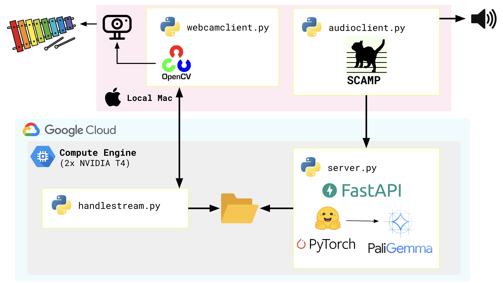
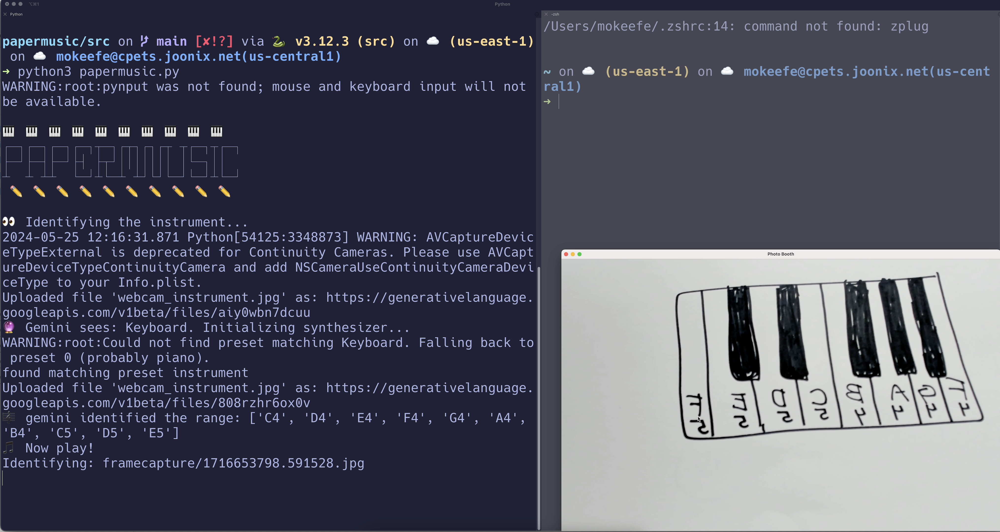

# 🎵 papermusic ✏️

draw an instrument, and play it! (fun with [PaliGemma](https://ai.google.dev/gemma/docs/paligemma) and [SCAMP](http://scamp.marcevanstein.com/))

([📺 Original implementation](https://www.youtube.com/watch?v=G5sSaLUskis&t=1s))

### architecture 

### screenshots 

  

### 📚 sources

- [PaliGemma](https://huggingface.co/google/paligemma-3b-pt-224?library=transformers) (vision-language model)
- [HuggingFace Transformers](https://huggingface.co/docs/transformers/index)
- [HuggingFace Inference Optimization](https://huggingface.co/docs/transformers/main/en/llm_optims)
- [SCAMP (Suite for Computer-Assisted Music in Python)](http://scamp.marcevanstein.com/)
- [ASCII Art Generator](https://patorjk.com/software/taag/#p=display&f=Graffiti&t=Type%20Something%20)
