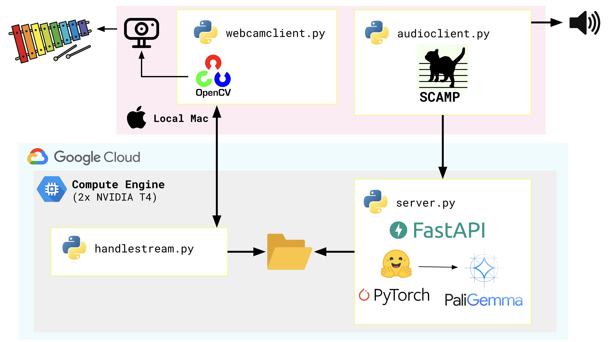

# 🎵 papermusic ✏️

draw an instrument, and play it! (fun with [PaliGemma](https://ai.google.dev/gemma/docs/paligemma) and [SCAMP](http://scamp.marcevanstein.com/))

### video walkthrough 

(click to play)

[](https://youtu.be/Gxjok5h7HIU)

([📺 Original implementation](https://www.youtube.com/watch?v=G5sSaLUskis&t=1s))

### architecture 




### screenshot 

  

## how to run 

Note - this is a prototype, not a production-grade app. (The OpenCV streaming setup is a bit buggy and occasionally crashes. You may need to restart.) 

**You will need:** 
- A local machine with a webcam, and Python 3.11+. (Client has been tested on MacOS Sonoma / M1 Mac). 
- A Google Cloud project, with access to Google Compute Engine.
- A HuggingFace account with an [Access Token](https://huggingface.co/docs/hub/en/security-tokens)  

#### Setup (Server) 

1. Create a Google Compute Engine instance with at least one GPU. I used two NVIDIA T4 GPUs, but adjust to whatever your quota allows. Set "Allow HTTP/HTTPS" traffic to `true`. 
2. SSH into the instance.
3. Install Python packages for the server workloads. 
```bash
git clone https://github.com/askmeegs/papermusic 
cd papermusic 
python3 -m venv . 
source ./bin/activate 
pip install -r requirements.txt
```
4. Set your HuggingFace Access Token as an environment variable. 
```bash
export HUGGINGFACE_USER_ACCESS_TOKEN=your_token_here
```

#### Setup (Client)

1. Clone the repo on your local machine.
```
git clone https://github.com/askmeegs/papermusic 
cd papermusic 
```

2. Install client packages. 
```
python3 -m venv . 
source ./bin/activate 
pip install -r requirements.txt
```

#### Run all components

Place a hand-drawn musical instrument in front of your webcam, like the screenshot shown above. Make sure the notes are written clearly on the instrument. 

1. Start `server/handlestream.py` on GCE, to listen for the webcam stream. 
2. Start `client/webcamclient.py` on your local machine, to send your webcam stream to GCE. 
3. Start `server/server.py` on GCE, to process the webcam stream and identify the notes. 
4. Start `client/audioclient.py` on your local machine, to poll the Server and play the notes over local audio.

### 📚 sources

- [PaliGemma](https://huggingface.co/google/paligemma-3b-pt-224?library=transformers) (vision-language model)
- [HuggingFace Transformers](https://huggingface.co/docs/transformers/index)
- [HuggingFace Inference Optimization](https://huggingface.co/docs/transformers/main/en/llm_optims)
- [SCAMP (Suite for Computer-Assisted Music in Python)](http://scamp.marcevanstein.com/)
- [ASCII Art Generator](https://patorjk.com/software/taag/#p=display&f=Graffiti&t=Type%20Something%20)
